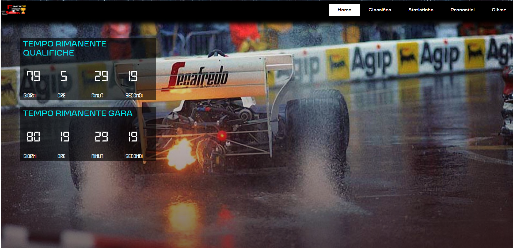
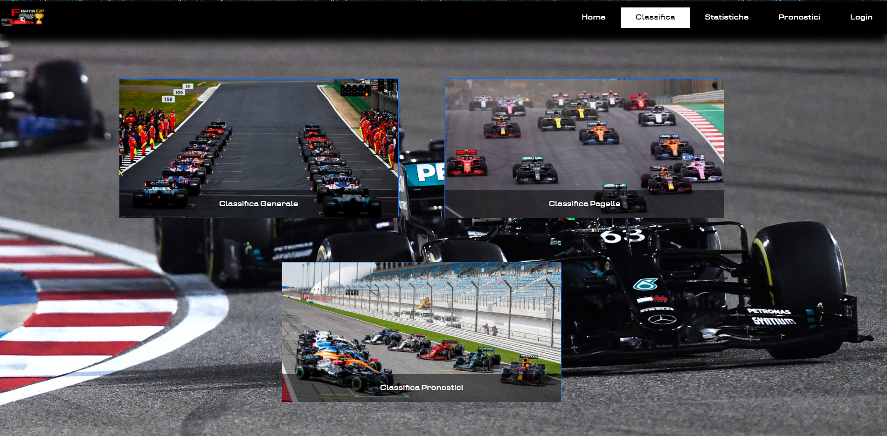
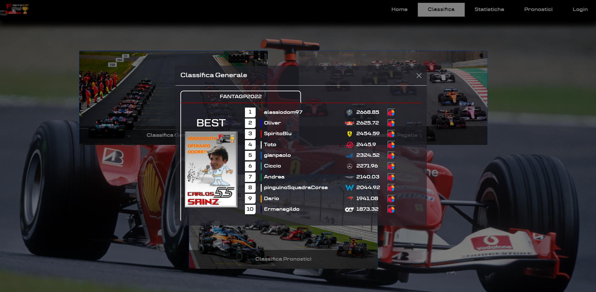
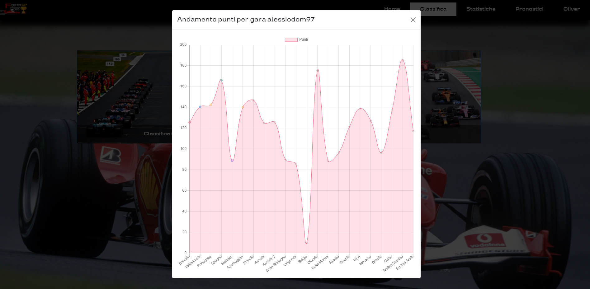
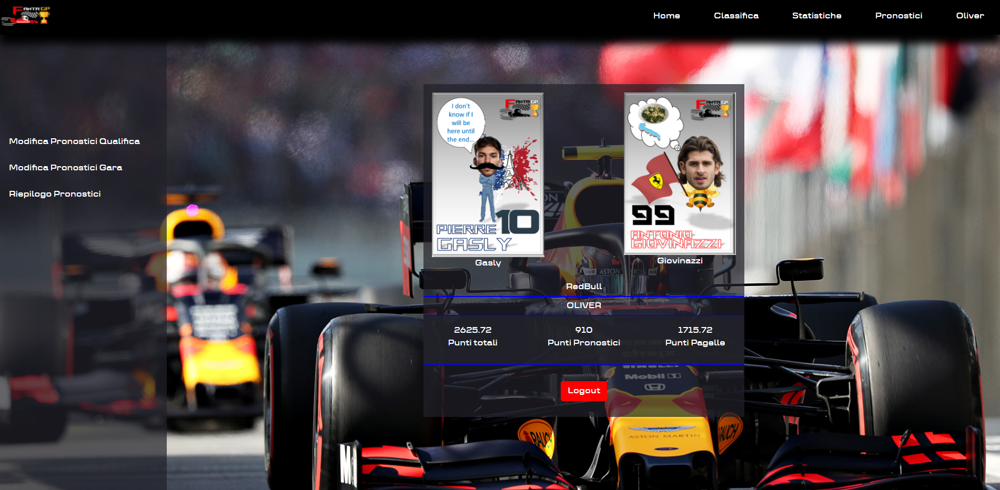
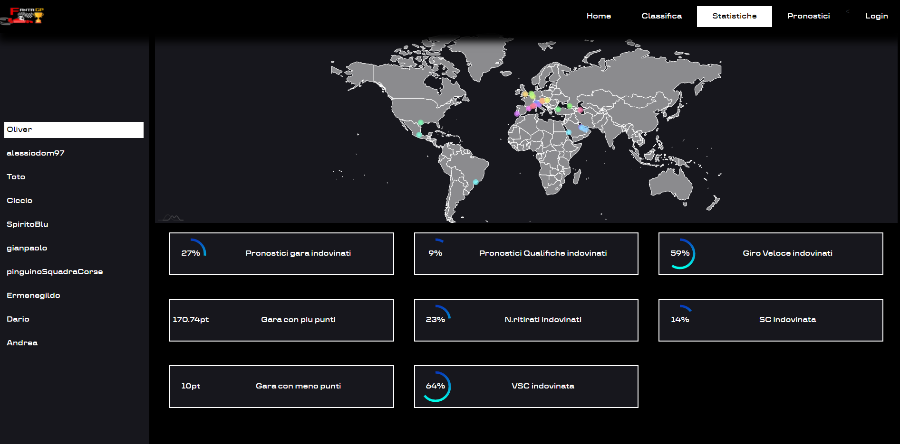
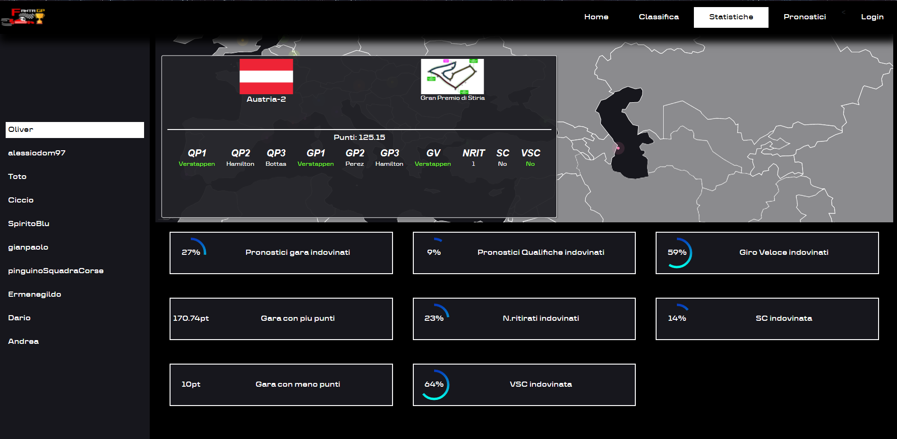

### About

This project is a web application used for predict the race of Formula. The user can insert is predictions in the Pronostici page, when the race is ended the admins can add the result of the race and can calculate the point based on the previous predictions. There is an another page to show the rating of all user called Classifica. For check the user stats of his predictios there is an another page called Statistiche

### About web applications

This web application is created with Laravel Framework and with PHP

### Image of various page

_HomePage_

_Classifica_

_Profilo_

_Statistiche_

